# Colored terminal demos

These deterministic recordings use the plugin's actual display controller. File events arrive at fixed intervals to make behavior reproducible; the timings illustrate process-wide metrics and do not measure individual file completion. Spinner frames advance with file events, replacing the previous progress block in an interactive terminal. Redirected output uses complete lines.

Animated GIFs follow the presentation used by eslint-plugin-file-progress-2. For a still image, see the [static terminal poster](../static/img/terminal.svg). The casts preserve selectable terminal text and ANSI colors.

Jump to [presets](#presets), [options](#options), or [recording instructions](#reproduce-the-recordings). Choose a [preset](./presets.md) or review the [option defaults](./activate.md#options) while comparing output.

## Presets

### recommended

Show each file using the default display options.


[Preset configuration](./presets/recommended.md) · [Terminal cast](../static/demos/casts/presets-recommended.cast)

### recommended-ci

Hide all plugin output when CI is exactly true.

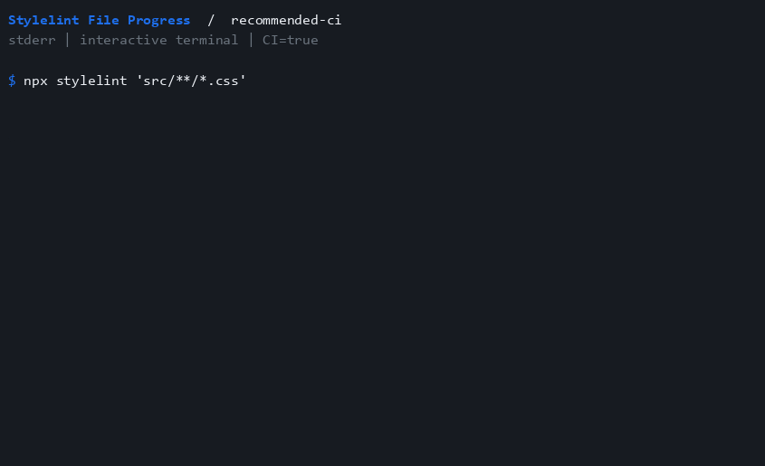

[Preset configuration](./presets/recommended-ci.md) · [Terminal cast](../static/demos/casts/presets-recommended-ci.cast)

### recommended-ci-detailed

Hide live output in CI while retaining the detailed process summary.

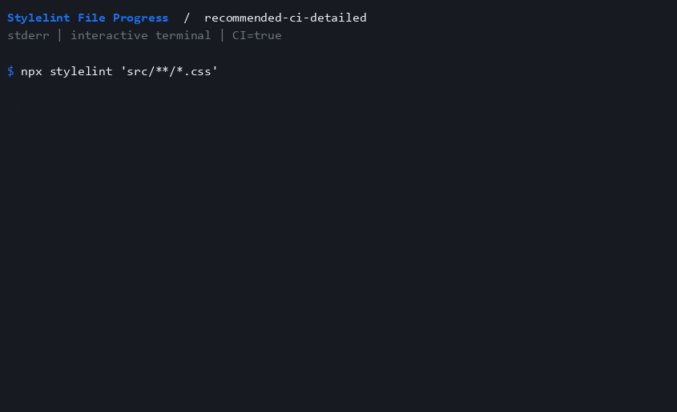

[Preset configuration](./presets/recommended-ci-detailed.md) · [Terminal cast](../static/demos/casts/presets-recommended-ci-detailed.cast)

### recommended-compact

Announce generic activity once, without showing filenames.


[Preset configuration](./presets/recommended-compact.md) · [Terminal cast](../static/demos/casts/presets-recommended-compact.cast)

### recommended-detailed

Show filenames and the detailed process summary.

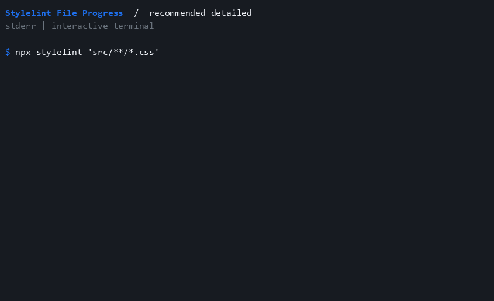

[Preset configuration](./presets/recommended-detailed.md) · [Terminal cast](../static/demos/casts/presets-recommended-detailed.cast)

### recommended-summary-only

Show only the final process summary.


[Preset configuration](./presets/recommended-summary-only.md) · [Terminal cast](../static/demos/casts/presets-recommended-summary-only.cast)

### recommended-tty

Show output only when stderr is an interactive terminal.


[Preset configuration](./presets/recommended-tty.md) · [Terminal cast](../static/demos/casts/presets-recommended-tty.cast)

The two CI recordings use CI=true; recommended-tty uses an interactive stderr stream.

## Options

Add these secondary options to the rule: `rules: { "file-progress/activate": [true, options] }`.

### pathFormat

Show basenames instead of relative paths.

```json
{
 "pathFormat": "basename"
}
```

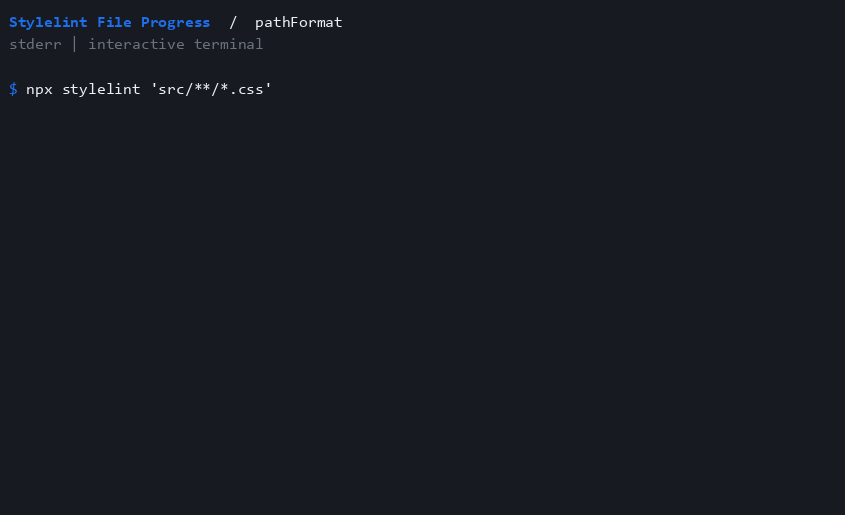

[Terminal cast](../static/demos/casts/options-pathFormat.cast)

### hideDirectoryNames

The deprecated alias still selects basename paths; prefer pathFormat.

```json
{
 "hideDirectoryNames": true
}
```


[Terminal cast](../static/demos/casts/options-hideDirectoryNames.cast)

### fileNameOnNewLine

Put the filename on its own indented line.

```json
{
 "fileNameOnNewLine": true
}
```

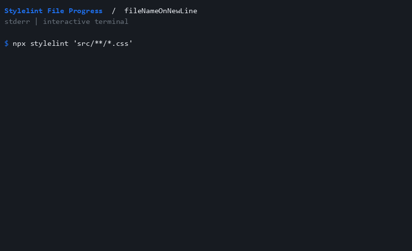

[Terminal cast](../static/demos/casts/options-fileNameOnNewLine.cast)

### hideFileName

Announce activity once without listing filenames.

```json
{
 "hideFileName": true
}
```


[Terminal cast](../static/demos/casts/options-hideFileName.cast)

### hidePrefix

Remove the SFP label and prefix mark.

```json
{
 "hidePrefix": true
}
```


[Terminal cast](../static/demos/casts/options-hidePrefix.cast)

### prefixMark

Choose a custom prefix mark.

```json
{
 "prefixMark": ">>"
}
```


[Terminal cast](../static/demos/casts/options-prefixMark.cast)

### successMark

Choose the mark used with a zero process exit code.

```json
{
 "successMark": "OK"
}
```

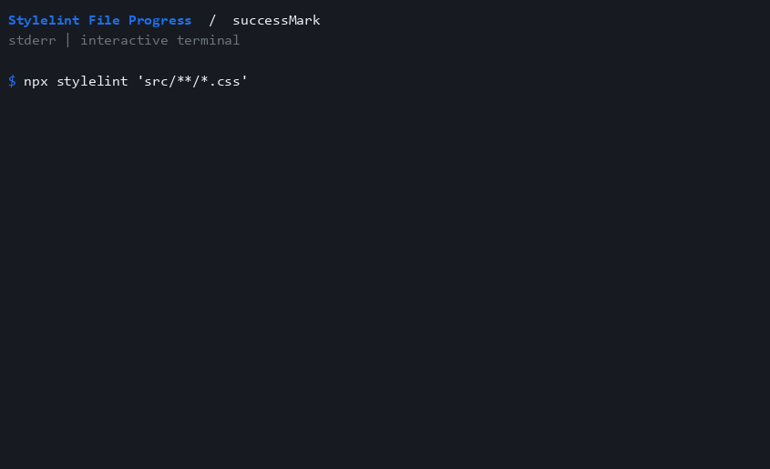

[Terminal cast](../static/demos/casts/options-successMark.cast)

### successMessage

Customize the shutdown message.

```json
{
 "successMessage": "Stylesheet pass finished."
}
```

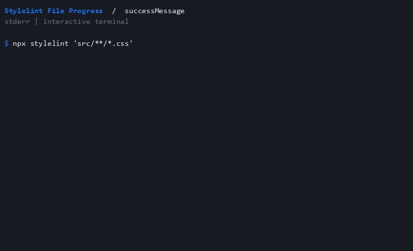

[Terminal cast](../static/demos/casts/options-successMessage.cast)

### failureMark

A nonzero process exit code selects red failure styling, without inventing problem totals.

```json
{
 "failureMark": "FAIL",
 "detailedSuccess": true
}
```


[Terminal cast](../static/demos/casts/options-failureMark.cast)

### detailedSuccess

Include observed files, elapsed process time, throughput, and exit code.

```json
{
 "detailedSuccess": true
}
```


[Terminal cast](../static/demos/casts/options-detailedSuccess.cast)

### mode-compact

Emit one activity notice, followed by the shutdown summary.

```json
{
 "mode": "compact"
}
```


[Terminal cast](../static/demos/casts/options-mode-compact.cast)

### mode-summary-only

Wait until process exit before displaying the summary.

```json
{
 "mode": "summary-only"
}
```


[Terminal cast](../static/demos/casts/options-mode-summary-only.cast)

### hide

Hide both progress and the shutdown summary.

```json
{
 "hide": true
}
```

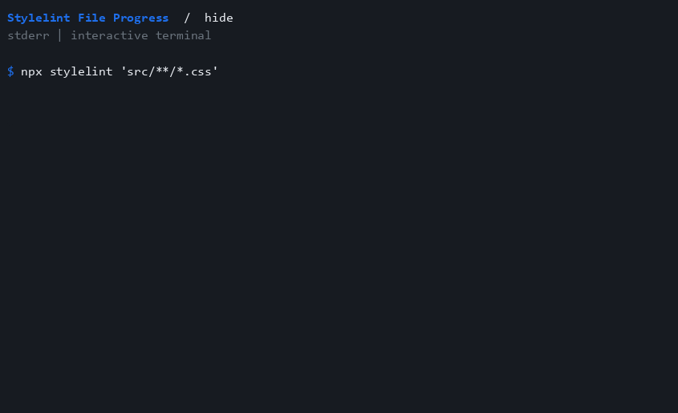

[Terminal cast](../static/demos/casts/options-hide.cast)

### showSummaryWhenHidden

Keep the process summary when live progress is hidden.

```json
{
 "hide": true,
 "showSummaryWhenHidden": true,
 "detailedSuccess": true
}
```

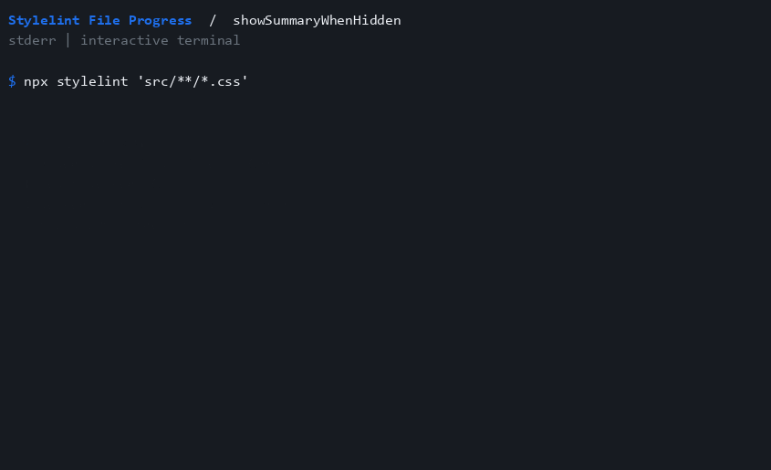

[Terminal cast](../static/demos/casts/options-showSummaryWhenHidden.cast)

### throttleMs

Limit live displays while still counting every observed file.

```json
{
 "throttleMs": 1000,
 "detailedSuccess": true
}
```


[Terminal cast](../static/demos/casts/options-throttleMs.cast)

### minFilesBeforeShow

Wait for three observed files before showing output.

```json
{
 "minFilesBeforeShow": 3,
 "detailedSuccess": true
}
```


[Terminal cast](../static/demos/casts/options-minFilesBeforeShow.cast)

### outputStream

Explicitly direct progress to stdout instead of the default stderr.

```json
{
 "outputStream": "stdout"
}
```

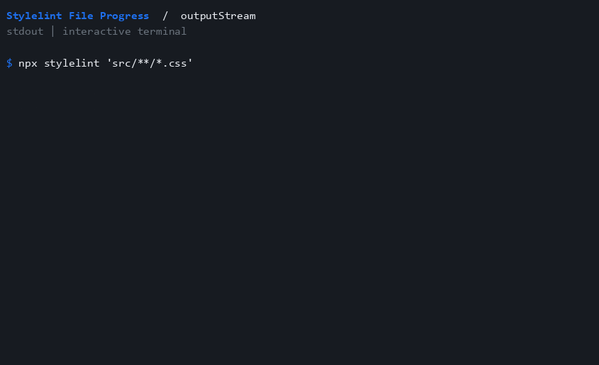

[Terminal cast](../static/demos/casts/options-outputStream.cast)

### ttyOnly

Suppress output when the selected stream is not a terminal.

```json
{
 "ttyOnly": true
}
```


[Terminal cast](../static/demos/casts/options-ttyOnly.cast)

### non-tty

Redirected output uses plain lines without spinner frames or color.

```json
{}
```

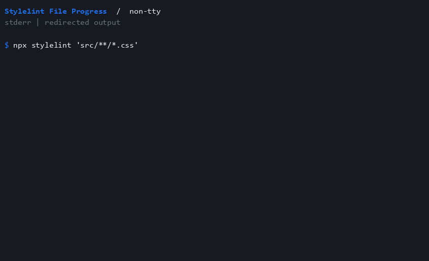

[Terminal cast](../static/demos/casts/options-non-tty.cast)

### spinnerStyle-arc

Use arc frames, advancing when files are observed.

```json
{
 "spinnerStyle": "arc"
}
```


[Terminal cast](../static/demos/casts/options-spinnerStyle-arc.cast)

### spinnerStyle-bounce

Use bounce frames, advancing when files are observed.

```json
{
 "spinnerStyle": "bounce"
}
```

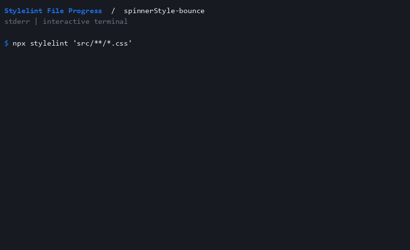

[Terminal cast](../static/demos/casts/options-spinnerStyle-bounce.cast)

### spinnerStyle-clock

Use clock frames, advancing when files are observed.

```json
{
 "spinnerStyle": "clock"
}
```


[Terminal cast](../static/demos/casts/options-spinnerStyle-clock.cast)

### spinnerStyle-dots

Use dots frames, advancing when files are observed.

```json
{
 "spinnerStyle": "dots"
}
```


[Terminal cast](../static/demos/casts/options-spinnerStyle-dots.cast)

### spinnerStyle-line

Use line frames, advancing when files are observed.

```json
{
 "spinnerStyle": "line"
}
```

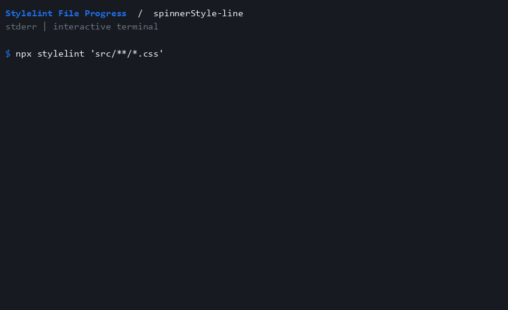

[Terminal cast](../static/demos/casts/options-spinnerStyle-line.cast)

## Reproduce the recordings

Install [agg 1.9.0](https://github.com/asciinema/agg/releases/tag/v1.9.0), then run `npm run build` and `npm run docs:demos:write`. The renderer uses the GitHub dark palette. Glyph appearance can vary with the system's monospace and fallback fonts.

`npm run docs:demos:check` regenerates the expected terminal traces in memory and checks every committed cast, GIF integrity hash, gallery entry, and static poster without writing files or requiring agg. Regenerate the recordings whenever output behavior changes.
