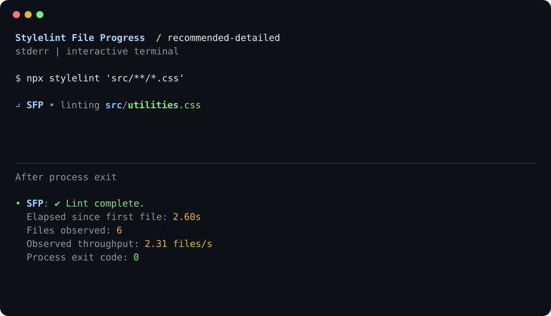

# See the stylesheet behind the wait

Stylelint File Progress shows files as they reach Stylelint's rule phase. Keep a readable trail of filenames, switch to compact activity, or show just a process summary.



## Get started

The initial npm release is being prepared. Until publication, install a tarball built from the repository with `npm pack`.

```js
export default {
 extends: ["stylelint-plugin-file-progress/configs/recommended"],
};
```

Keep your existing shared config before the progress preset in `extends`. Your lint rules, fixes, and normal report continue to work.

## Pick your display

- [Configure the rule](./activate.md): filenames, streams, marks, spinner frames, and throttling.
- [Choose a preset](./presets.md): seven configurations matching the ESLint progress package.
- [Understand the metrics](./compatibility.md): process summaries, cached files, and custom syntax.
- [Develop the plugin](./developer/contributing.md): local checks, clean consumers, and generated docs.

Default progress goes to stderr, leaving stdout untouched. Stylelint also writes its normal CLI report to stderr; use its `--output-file report.json --formatter json` options for an intact machine-readable report.
