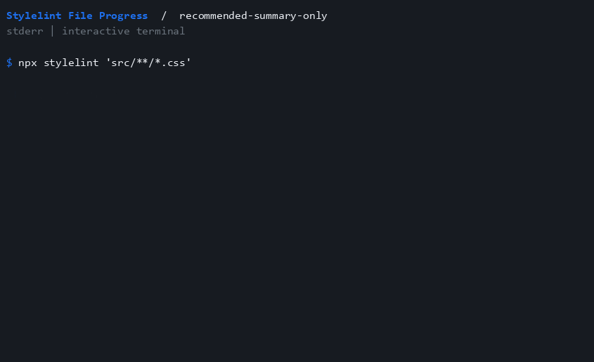

# recommended-summary-only

Show only the final process summary.

```js
export default {
 extends: ["stylelint-plugin-file-progress/configs/recommended-summary-only"],
};
```



See [all options](../activate.md) and [compatibility](../compatibility.md) for summary and terminal behavior.
